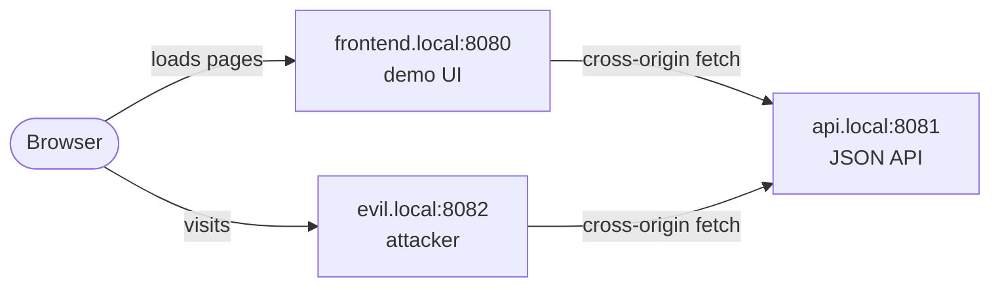
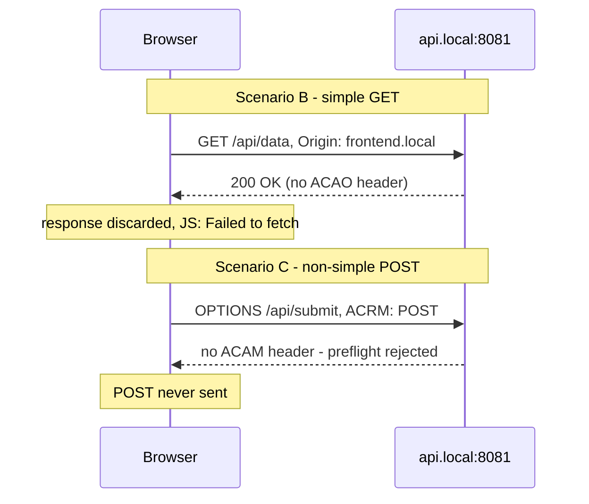
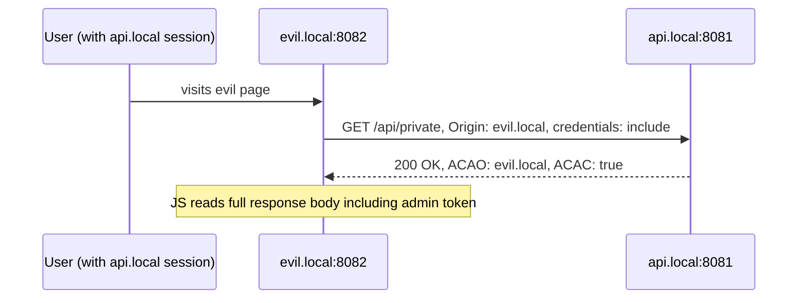
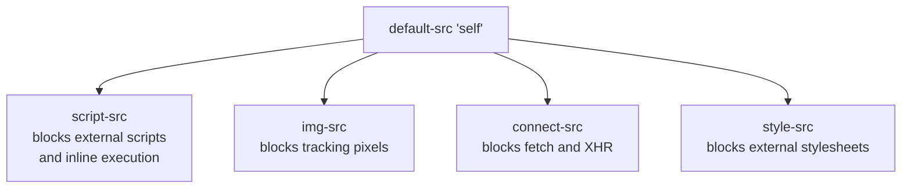
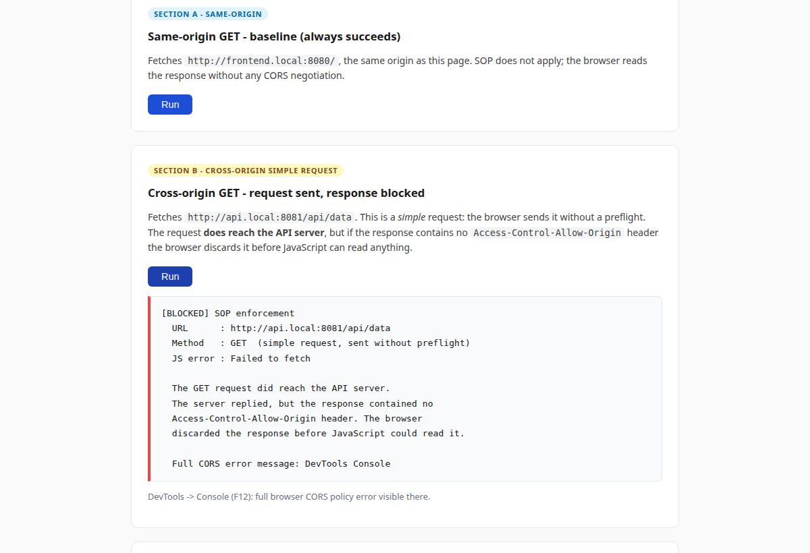
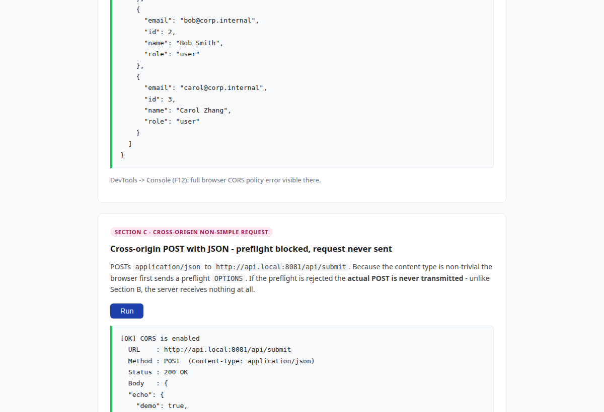
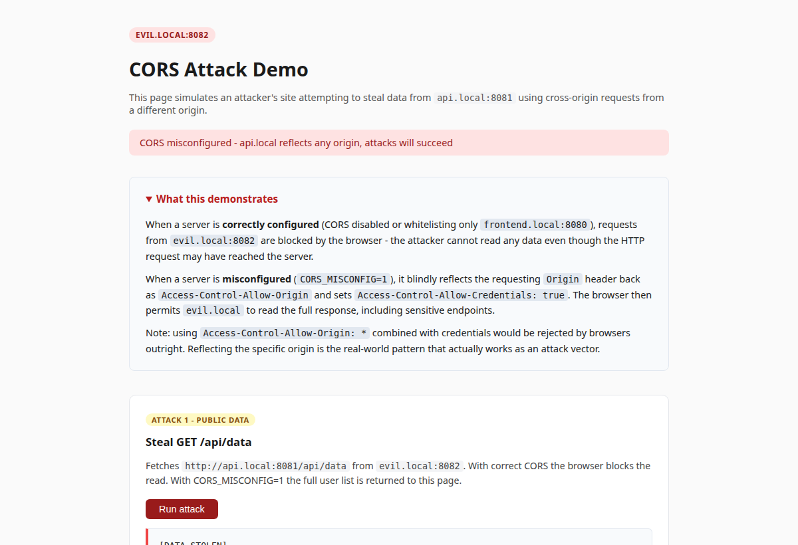
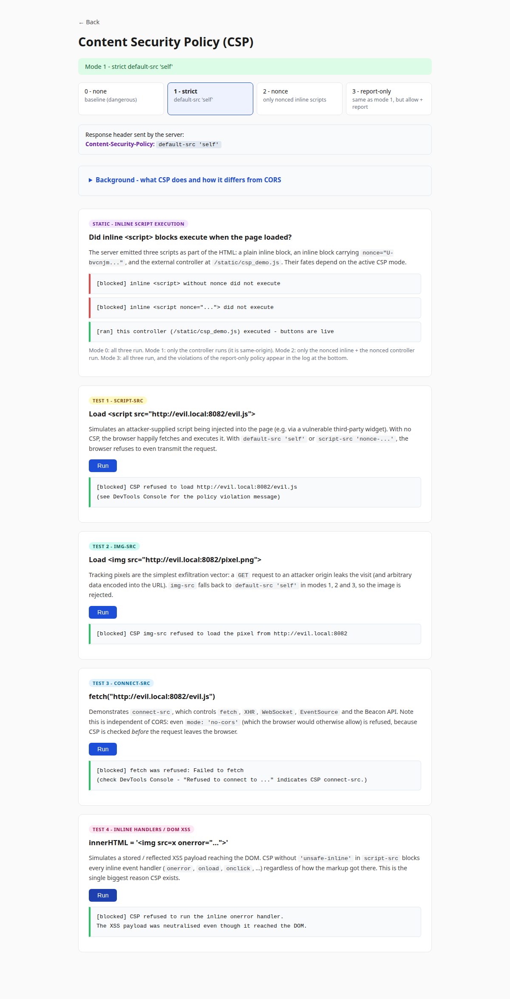
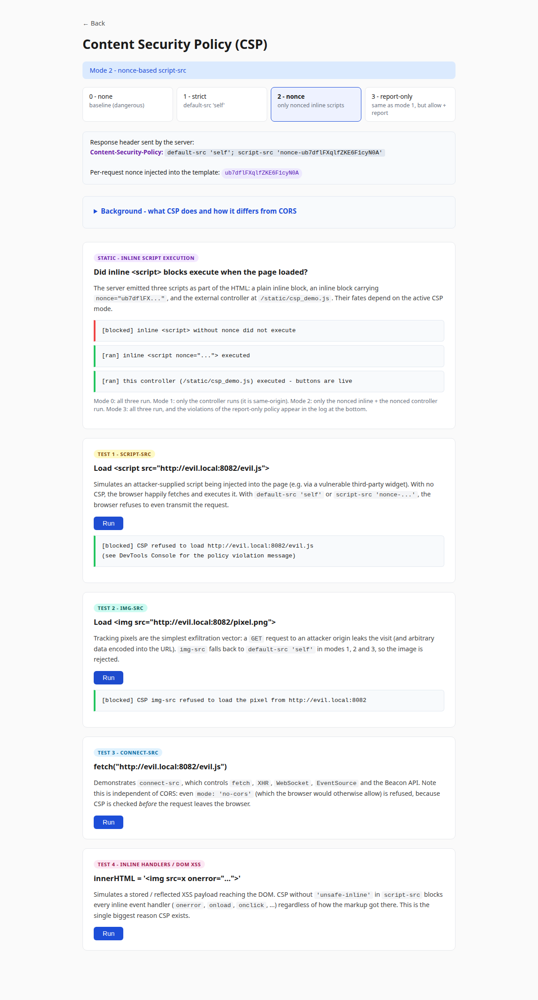
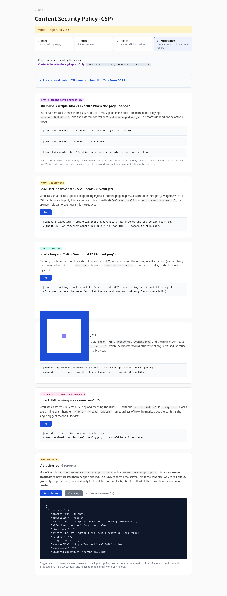

# CORS and CSP - Proof of Concept

**Team:** Ramazan Nazmiev, Asgat Keruly, Yusuf Abdugafforzoda, Sergei Glazov

---

## Abstract

We built a three-origin HTTP environment on a single machine to demonstrate how browsers enforce Cross-Origin Resource Sharing (CORS) and Content Security Policy (CSP). Testing six attack and defense scenarios showed that each policy operates independently: a misconfigured CORS policy cannot be compensated by a strong CSP, and vice versa.

---

## Introduction

By default, a browser blocks JavaScript from reading responses that come from a different origin. An origin is the combination of scheme, host, and port - all three must match exactly. This default behavior is the Same-Origin Policy (SOP), and it is the foundation that both CORS and CSP build on.

**CORS** is controlled by the destination server. It decides which origins are allowed to read its responses by returning an `Access-Control-Allow-Origin` header. Without it, the browser discards the response body even if the HTTP request already reached the server.

**CSP** is controlled by the page's own server. It decides what the page is allowed to load or execute. A resource blocked by CSP never triggers a network request at all - CORS is never consulted.

This PoC addresses four questions:

1. What does the browser do by default when a page fetches data from a different origin?
2. What additional step happens for non-simple requests (preflight)?
3. What are the consequences of a common CORS misconfiguration?
4. How does CSP block attack vectors that CORS does not address, and how can it be rolled out safely?

---

## Methods

### Infrastructure

Three Flask servers run on one machine. Local hostname resolution via `/etc/hosts` creates three distinct browser origins on the same IP address. Plain HTTP is used deliberately - no SSL is needed to demonstrate CORS or CSP, and certificate warnings would interfere with the demo.

| Server | Origin | Role |
|--------|--------|------|
| frontend | `http://frontend.local:8080` | serves the demo UI |
| api | `http://api.local:8081` | the protected JSON API |
| evil | `http://evil.local:8082` | simulated attacker site |



CORS behavior is controlled by environment variables read at server startup, mirroring how real applications configure security middleware:

```bash
CORS_ENABLED=1   ./run_all.sh   # proper CORS - frontend.local only
CORS_MISCONFIG=1 ./run_all.sh   # origin reflection - any origin accepted
```

CSP mode is switched via `?mode=0|1|2|3` on the `/csp-demo` page without restarting.

### CORS scenarios

Three scenarios cover the main CORS behaviors.

**Scenario A - same-origin baseline.** Fetches `http://frontend.local:8080/`. SOP does not apply; the request always succeeds. This baseline confirms the infrastructure works.

**Scenario B - simple cross-origin request.** A plain `GET` to `api.local:8081/api/data` is a "simple request" - the browser sends it without a preflight and checks the response headers. If `Access-Control-Allow-Origin` is absent, the response body is discarded and JavaScript receives `TypeError: Failed to fetch`.

**Scenario C - non-simple cross-origin request.** A `POST` with `Content-Type: application/json` triggers a preflight `OPTIONS` before the actual request. If the preflight is rejected, the POST is never sent.



**CORS misconfiguration.** The API reflects any incoming `Origin` header back as `Access-Control-Allow-Origin` and sets `Access-Control-Allow-Credentials: true`. Using a wildcard `*` instead would be rejected by the browser when credentials are involved, so reflecting the specific origin is the real-world attack pattern:

```python
origin = request.headers.get("Origin", "*")
response.headers["Access-Control-Allow-Origin"] = origin
response.headers["Access-Control-Allow-Credentials"] = "true"
```

The resulting attack chain:



### CSP scenarios

The frontend server generates a fresh nonce on every `/csp-demo` request using `secrets.token_urlsafe(16)` - 16 bytes from the OS CSPRNG. The same value is placed in the `Content-Security-Policy` header and in the `nonce` attribute of every legitimate `<script>` tag. An injected script never has the nonce.

| Mode | Header | Behavior |
|------|--------|----------|
| 0 | none | no restrictions - baseline |
| 1 | `Content-Security-Policy: default-src 'self'` | blocks all cross-origin loads and all inline scripts |
| 2 | `Content-Security-Policy: default-src 'self'; script-src 'nonce-X'` | only nonce-carrying scripts run |
| 3 | `Content-Security-Policy-Report-Only: default-src 'self'; report-uri /csp-report` | violations reported but not blocked |

Four tests cover the main attack vectors: loading an external script (`script-src`), loading a tracking pixel (`img-src`), issuing a fetch request (`connect-src`), and injecting an inline event handler via `innerHTML` (DOM XSS via `onerror`).

The `default-src 'self'` directive acts as a fallback for every resource type that lacks its own explicit directive:



---

## Results

### CORS - default behavior (disabled)

With no CORS headers on the API, the browser enforces SOP. Section B shows the GET reaching the server and the server replying normally, but JavaScript receives only `TypeError: Failed to fetch`. The server has no way to tell that its response was discarded.



Section C adds a preflight gate: the OPTIONS is rejected so the POST body is never transmitted and the server receives nothing after the preflight.

### CORS - correct configuration

With `CORS_ENABLED=1`, responses carry `Access-Control-Allow-Origin: http://frontend.local:8080`. Section B reads the JSON data successfully. Section C's preflight is approved and the POST completes.



### CORS - misconfiguration attack

With `CORS_MISCONFIG=1`, the attack page at `evil.local:8082` reads the full user list with a plain GET. The banner confirms "CORS misconfigured" before any button is clicked - the banner's own cross-origin status fetch succeeded from `evil.local`, which is itself a live demonstration of the problem.



### CSP - mode 1, strict enforcement

`default-src 'self'` blocks all four test vectors with a single directive. The external script request never leaves the browser. The tracking pixel, the `no-cors` fetch, and the injected `onerror` handler are all refused.



### CSP - mode 2, nonce-gated scripts

The header box shows the exact `Content-Security-Policy` header the server sent, including the nonce value. The controller script (`/static/csp_demo.js`) carries the matching nonce attribute and loads in all modes. External scripts without the nonce are blocked.



### CSP - mode 3, report-only

`Content-Security-Policy-Report-Only` does not block anything. The external script runs and the pixel loads. The browser POSTs a violation report to `/csp-report` for each would-be violation. The log panel polls every 3 seconds and shows the structured JSON reports with `violated-directive` and `blocked-uri` fields.



### Independence of CORS and CSP

Test 3 (`connect-src`) fetches `evil.local:8082/evil.js` with `mode: 'no-cors'`. In mode 0 the request reaches `evil.local` regardless of the CORS setting on the API. In mode 1, CSP blocks the fetch before it leaves the browser and CORS is never involved. This single result confirms that the two policies operate at different stages and neither replaces the other.

---

## Discussion

**CORS.** The most important finding is the asymmetry between simple and non-simple requests. For a simple GET, the request reaches the server and the server responds normally, but the browser silently discards the body if ACAO is absent - the server cannot detect this. For a non-simple request, the preflight gate prevents the real request from being sent at all. The misconfiguration result is the starkest: reflecting the `Origin` header combined with `Allow-Credentials: true` gives any website read access to every API endpoint using the victim's own session cookies. Using `*` is rejected by browsers when credentials are present, so the reflected-origin pattern is a genuine, working attack vector.

**CSP.** One directive (`default-src 'self'`) covers six distinct attack vectors because all resource-type directives fall back to `default-src` when not explicitly set. Nonces solve the practical deployment problem: legitimate inline scripts carry the per-request nonce, while injected scripts never have it. Mode 3 (report-only) is the safe deployment path for existing sites - observe what the policy would block in real traffic, tighten the allowlist, then switch to enforcement.

**Limitations.** The CSP violation log is in-memory and is cleared on server restart. No real session cookies exist in the demo, so the credential theft scenario is illustrative rather than directly exploitable. All three origins run on the same physical machine.

---

## Setup

```bash
# 1. Add hostnames (once, requires root)
sudo tee -a /etc/hosts < etc_hosts.txt

# 2. Install dependencies
pip3 install -r requirements.txt

# 3. Run
./run_all.sh                     # CORS disabled, CSP mode 0
CORS_ENABLED=1 ./run_all.sh      # proper CORS
CORS_MISCONFIG=1 ./run_all.sh    # attack demo mode
```

Open `http://frontend.local:8080` in a browser. Switch CSP mode with `?mode=0|1|2|3` on the `/csp-demo` page.
